# AOM System Diagrams

Visual reference for system architecture, state machines, and key flows.

---

## 1. System Architecture

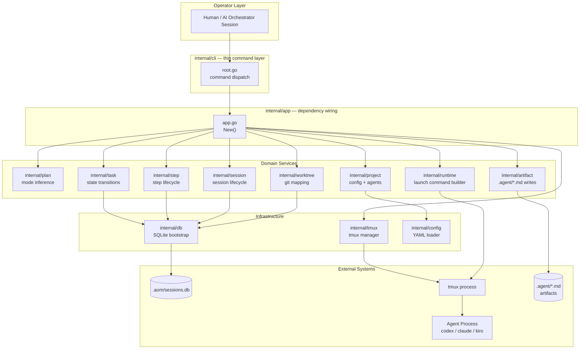

---

## 2. Package Dependency Direction

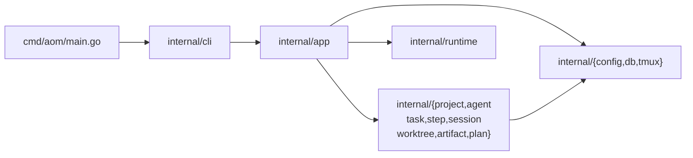

---

## 3. Three-Layer Truth Model

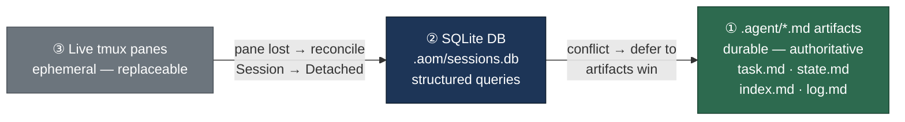

---

## 4. Task State Machine

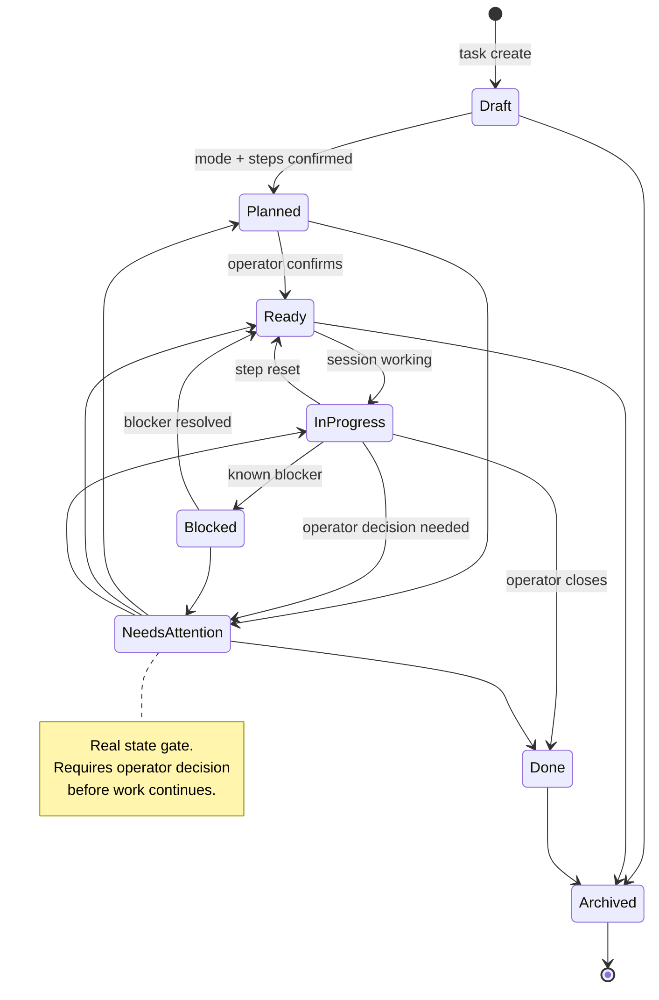

---

## 5. Session State Machine

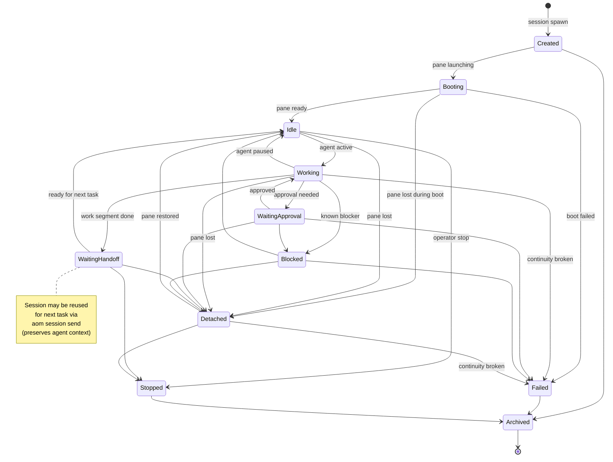

---

## 6. Worktree State Machine

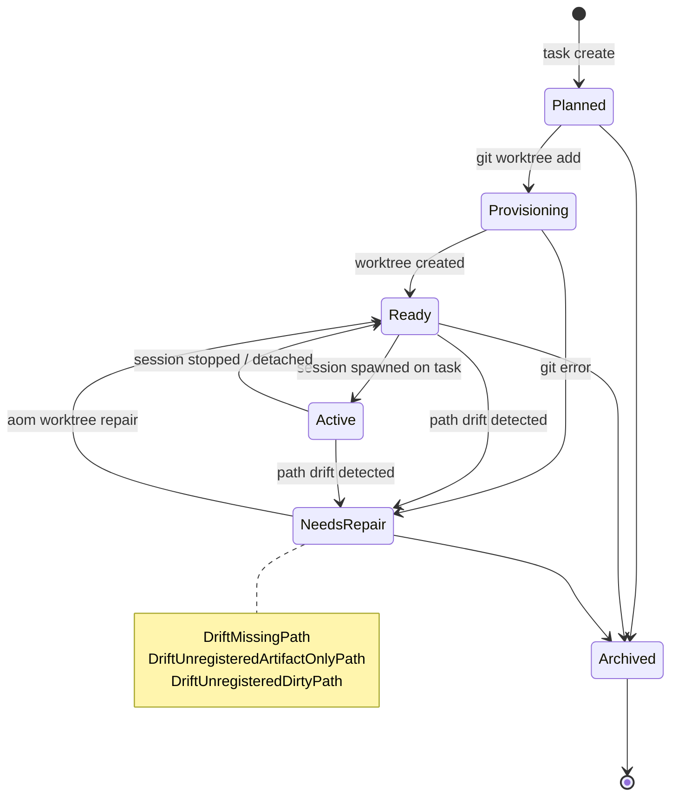

---

## 7. Step State Machine

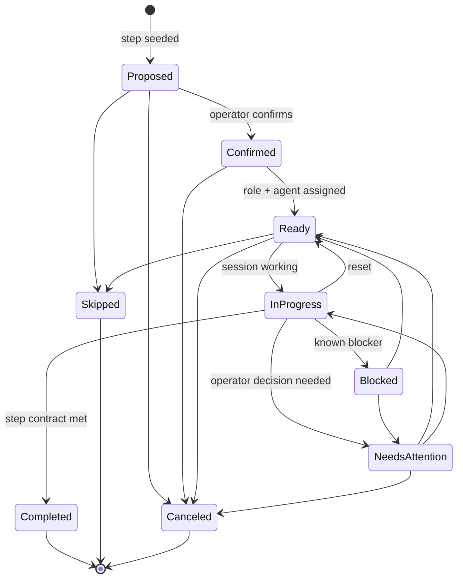

---

## 8. Session Spawn Flow

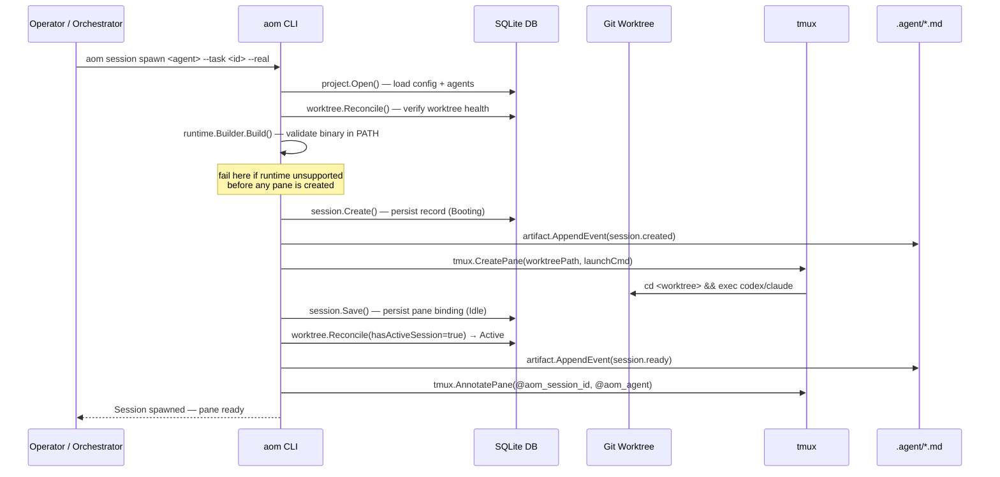

---

## 9. AI Orchestrator Loop

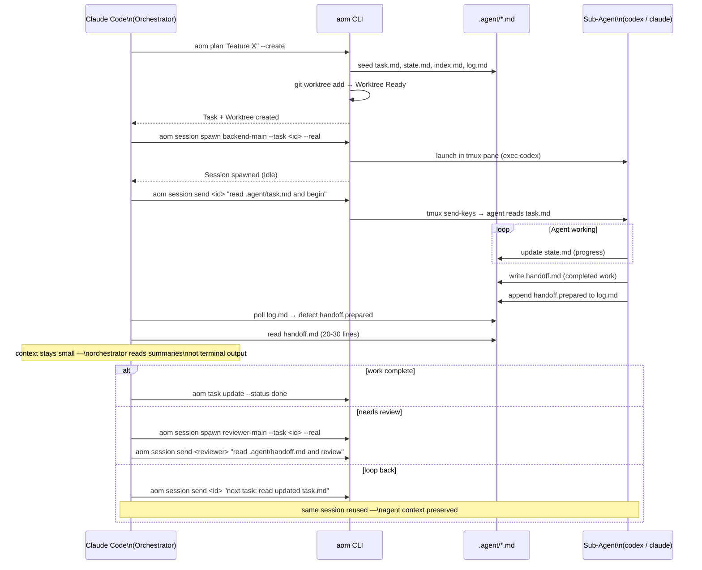

---

## 10. Artifact Lifecycle

```mermaid
graph TD
    TC["task create / plan --create"]
    SS["session spawn --task"]
    SU["step update"]
    TU["task update"]
    AI["aom attach\n(operator.intervention)"]
    SR["session replace"]
    WR["worktree repair"]
    CP["checkpoint"]
    HO["handoff"]

    TC -->|"seed"| TM["task.md"]
    TC -->|"seed"| SM["state.md"]
    TC -->|"seed"| IM["index.md"]
    TC -->|"seed"| LM["log.md"]
    TC -->|"seed if mode"| RM["requirements.md\ndesign.md\ntasks.md"]

    SS -->|"refresh + append session.created\nsession.ready"| IM
    SS -->|"append events"| LM

    SU -->|"refresh + append step.updated"| IM
    SU -->|"append"| LM

    TU -->|"refresh + append task.updated"| SM
    TU -->|"refresh"| IM
    TU -->|"append"| LM

    AI -->|"refresh + append operator.intervention"| IM
    AI -->|"append"| LM

    SR -->|"refresh + append session.replaced"| IM
    SR -->|"append"| LM

    WR -->|"append worktree.repaired"| LM

    CP -->|"append checkpoint.created"| LM
    CP -->|"refresh"| IM

    HO -->|"write / refresh"| HM["handoff.md"]
    HO -->|"append handoff.prepared"| LM
    HO -->|"refresh"| IM

    subgraph "AOM-owned (never written by agents)"
        IM
        LM
    end

    subgraph "Agent-updated under AOM protocol"
        TM
        SM
        HM
        RM
    end
```

---

## 11. Operator Definition (Human vs AI)

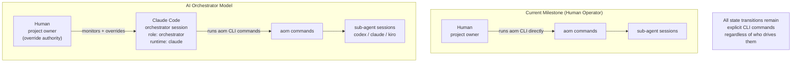

---

## 12. Runtime Identity File Delivery

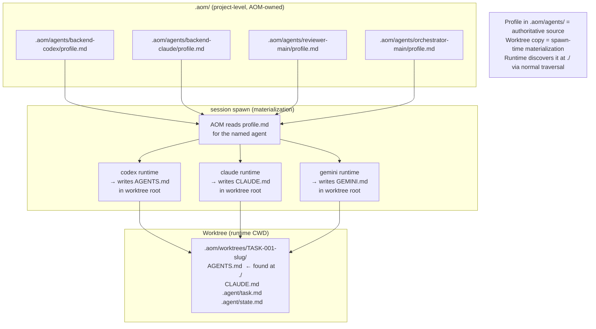

---

## 13. Multi-Session Agent Model

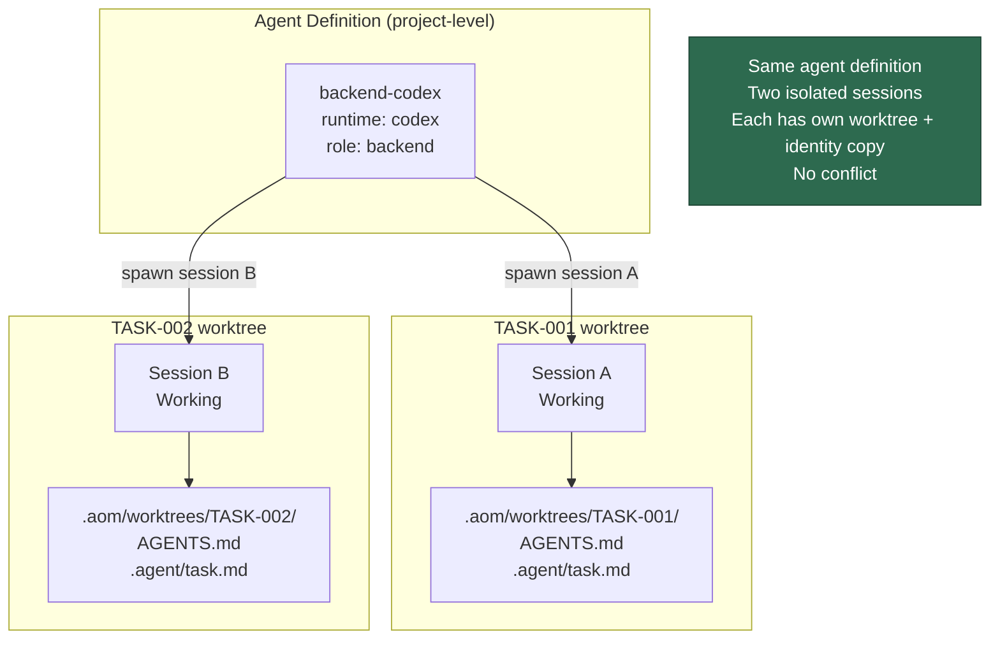
